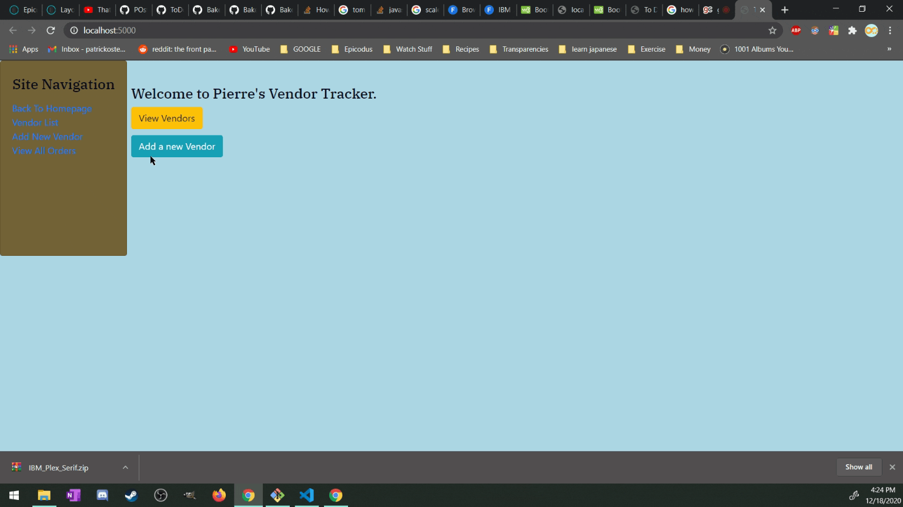

# Pierres

#### **This is a Vendor and Order tracking program for Pierres Bakery. Patrick Osten, 12/11/2020**

## Description

This application will allow a business owner to track vendors orders that buy from the business. It includes a splash page, a page for adding/viewing all vendors, order details, and viewing all current orders.  

## Installation Requirements

- Up to date internet browser ([Chrome](https://www.google.com/chrome/?brand=CHBD&gclid=Cj0KCQjw28T8BRDbARIsAEOMBcy9jwgkNels1LOSIWTx4sDazLfEgC6PylTug62KqyWPeA0EMyr3254aAjTTEALw_wcB&gclsrc=aw.ds), [Mozilla](https://www.mozilla.org/en-US/firefox/), [Opera](https://www.opera.com/)).
 
 -**optional**- 
- Code editor like [VsCode](https://**Code**.visualstudio.com/download) to view source **Code**.

## Setup

Expand 

 

#### From the web
1. Go to this [GitHub Repo Page](https://github.com/POsten040/Pierres).
2. Click the "Code" and click the 'Download zip' option.
3. Unzip the file, navigate to the **Pierres.Tests** directory and in the terminal run : `dotnet restore`
4. To run the tests from the terminal type: `dotnet test`
5. After that is successful navigate to the **Pierres** directory and type in the terminal: `dotnet run`

## Specs

Expand 

 

### Describe
<table>
  <tr>
    <th>Test</th>
    <th>Input</th>
    <th>Expect</th>
  <tr>
    <td>Create instance of Vendor with name, description, and static list of orders</td>
    <td>New Vendor</td>
    <td>New vendor object with public properties</td>
  <tr>
    <td></td>
    <td></td>
    <td></td>
  <tr>
    <td></td>
    <td></td>
    <td></td>
  <tr>
    <td></td>
    <td></td>
    <td></td>
  
</table>

## Contact 
- posten.coding@gmail.com

## Technologies Used

- C#
- MSTest
- .NET core 2.2

## License

[MIT license](https://opensource.org/licenses/MIT)

## Copyright (c) 2020 **_Patrick Osten_**

Permission is hereby granted, free of charge, to any person obtaining a copy of this software and associated documentation files (the "Software"), to deal in the Software without restriction, including without limitation the rights to use, copy, modify, merge, publish, distribute, sublicense, and/or sell copies of the Software, and to permit persons to whom the Software is furnished to do so, subject to the following conditions:

The above copyright notice and this permission notice shall be included in all copies or substantial portions of the Software.

THE SOFTWARE IS PROVIDED "AS IS", WITHOUT WARRANTY OF ANY KIND, EXPRESS OR IMPLIED, INCLUDING BUT NOT LIMITED TO THE WARRANTIES OF MERCHANTABILITY, FITNESS FOR A PARTICULAR PURPOSE AND NONINFRINGEMENT. IN NO EVENT SHALL THE AUTHORS OR COPYRIGHT HOLDERS BE LIABLE FOR ANY CLAIM, DAMAGES OR OTHER LIABILITY, WHETHER IN AN ACTION OF CONTRACT, TORT OR OTHERWISE, ARISING FROM, OUT OF OR IN CONNECTION WITH THE SOFTWARE OR THE USE OR OTHER DEALINGS IN THE SOFTWARE.